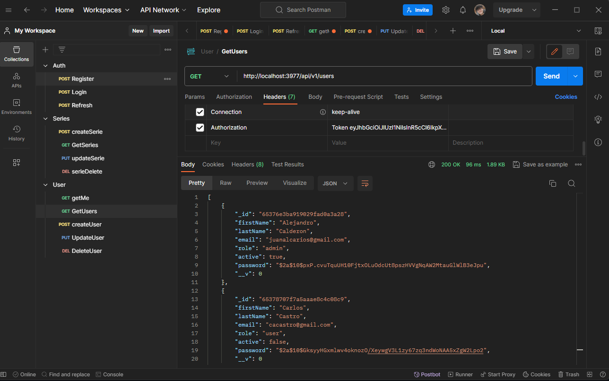
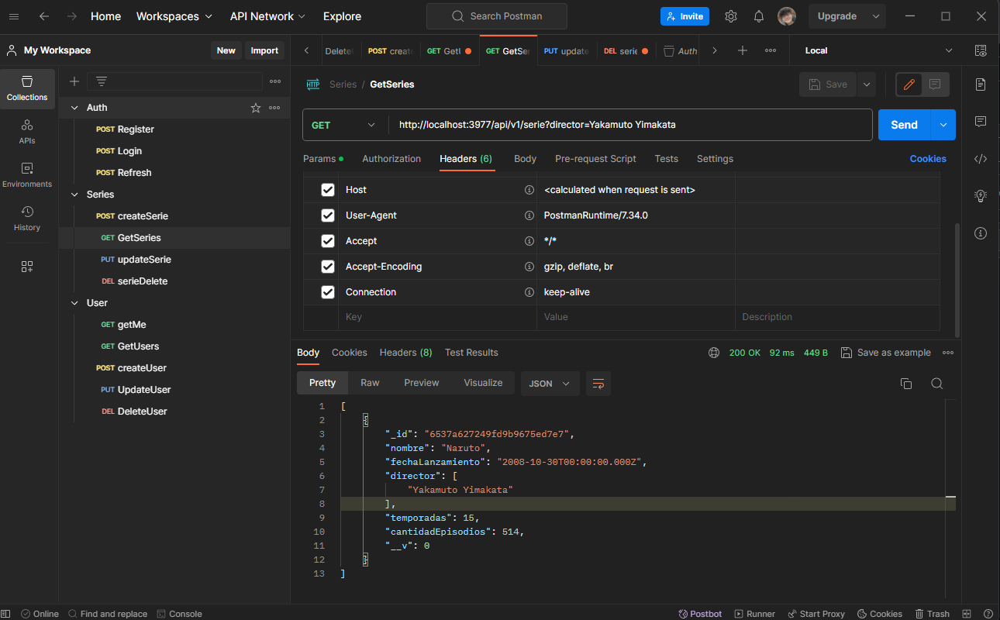
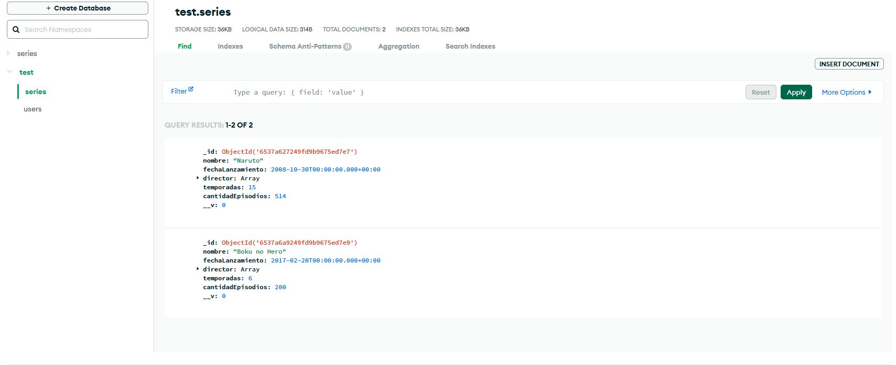
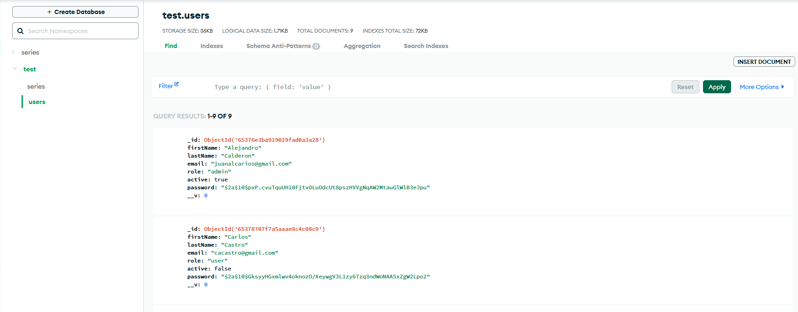

# API REST para Registro de Series de Televisión



## Descripción

Esta API REST permite el registro de información básica sobre series, directores y usuarios. Cada serie puede tener varios directores y un director puede haber participado en varias series. La API ofrece métodos para registrar, listar, modificar y eliminar la información de series y directores.



Se deben instalar las dependencias principales con el siguiente comando:

```bash
yarn add express nodemon jsonwebtoken body-parser mongoose bcryptjs cors
```

El servidor debe ejecutarse mediante el comando:
```bash
yarn dev
```
Lo que iniciara una instancia de nodemon que permite una ejecucion constante del servicio y actualizacion permanente de las peticiones.
## Endpoints Disponibles

## API
- `api/v1`: Es la raiz del servidor en su version 1, todas las peticiones deben realizarce a la ruta completa  `http://localhost:3977/api/v1/user/:id`
### Usuarios
- `GET /user/me`: Obtiene el usuario que hace la peticion.
- `GET /users`: Obtiene la lista de usuarios registrados.
- `POST /user`: Registra un nuevo usuario.
- `PUT /user/:id`: Modifica los datos de un usuario existente.
- `DELETE /user/:id`: Elimina un usuario por su ID.

### Series de Televisión
- `GET /serie`: Obtiene la lista de series de televisión registradas.
- `POST /serie`: Registra una nueva serie de televisión.
- `PUT /serie/:id`: Modifica los datos de una serie de televisión existente.
- `DELETE /serie/:id`: Elimina una serie de televisión por su ID.

## Uso de la API

### Registro de Usuarios
- Utiliza el método `POST /user` para registrar un nuevo usuario.
- Debes proporcionar un objeto JSON con los datos del usuario, incluyendo `firstName`, `lastName`, `email`, `password` y otros campos relevantes.

### Registro de Series de Televisión
- Utiliza el método `POST /series` para registrar una nueva serie de televisión.
- Proporciona un objeto JSON con la información de la serie, incluyendo `nombre`, `fechaLanzamiento`, `director`, `temporadas`, `cantidadEpisodios` y otros datos.


### Listado de Series, Directores y Usuarios
- Utiliza el método `GET /series` y `GET /users` para obtener la lista completa de series, directores y usuarios registrados.
- Los endpoint de series permiten realizar el filtro de directores y asi devolver todas las series en las que participo un director mediante el query en la solicitud de este tipo 'http://localhost:3977/api/v1/serie?director=Nombre'

### Modificación de Datos
- Utiliza los métodos `PUT` para modificar la información de series, directores o usuarios. Especifica el ID del elemento que deseas modificar en la URL y proporciona los datos actualizados en el cuerpo de la solicitud.

### Eliminación de Datos
- Utiliza los métodos `DELETE` para eliminar series, directores o usuarios. Especifica el ID del elemento que deseas eliminar en la URL.

## Integración con Base de Datos
Esta API está integrada con una base de datos MongoDB alojada en Mongo Atlas. Asegúrate de que la conexión a la base de datos esté configurada correctamente en la aplicación.






## Ejemplos de Uso
A continuación se proporcionan ejemplos de solicitud utilizando la herramienta Postman:

### Registro de un Usuario (POST)
```bash
- POST /user
  {
  "firstName": "John",
  "lastName": "Doe",
  "email": "john@example.com",
  "password": "secretpassword"
  }
```
Registro de una Serie (POST):

```bash

POST /series
{
  "nombre": "Mi Serie Favorita",
  "fechaLanzamiento": "2023-01-01",
  "director": ["Director1", "Director2"],
  "temporadas": 5,
  "cantidadEpisodios": 50
}
```

Listado de Series (GET):
```bash


GET /serie
```
Modificación de una Serie (PUT):

```bash

PUT /serie/:id
{
  "nombre": "Nueva Serie",
  "temporadas": 6
}
```

Eliminación de un Usuario (DELETE):

```bash

DELETE /user/:id
```

